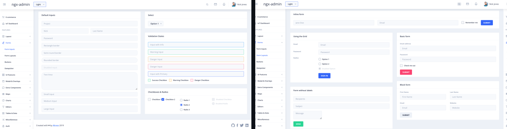

<a href="#">
    
</a>

# Playwright Test Automation Architecture Showcase

This repository demonstrates my approach to designing a maintainable and scalable test automation architecture using Playwright. 



The project focuses specifically on automation of form-related UI components.

The goal is to present how test architecture, locator strategy, and Page Object design can be applied to real UI components.

<br >

## Approaches Used (Design Patterns and Principles)
- COM (Component Object Model)<br>
- DRY (Don't Repeat Yourself)<br>
- KISS (Keep It Simple)<br>
- Descriptive Naming<br>
- Stability over Cleverness<br>

<br >

## Locator Strategy
This repository follows a locator strategy aligned with modern Playwright best practices.
Selectors are chosen based on stability, accessibility, and maintainability.

Whenever possible, selectors reflect how a real user interacts with the UI, rather than relying on fragile DOM structure or styling classes.

Selectors are chosen using the following hierarchy:
```sh
1. getByRole() with accessible name
2. getByLabel()
3. getByTestId()
4. getByPlaceholder()
5. getByText()
6. CSS locator (as a fallback)
7. XPath (avoided unless absolutely necessary)
```


<br >


##  Test Framework Based on ngx-admin Application
Ngx-admin project is considered legacy and has not been actively maintained for several years. Due to outdated dependencies and compatibility issues with modern Node.js environments, running the application locally may require additional configuration.

To ensure a consistent and reproducible test environment, the application is executed inside a **Docker container**. This approach isolates the runtime dependencies and simplifies the setup process for anyone cloning the repository.

The original repo is here: https://github.com/akveo/ngx-admin

<br >

## Technology Stack

- Playwright Test **1.58**
- TypeScript *(via Playwright built-in transpilation)*
- Node.js **18 (LTS)**

<br >

## Installation

Clone the repository

```bash
git clone https://github.com/rkolcz/playwright-forms-tests.git
cd playwright-forms-tests
```
Install dependencies
```bash
npm install
```
Install Playwright browsers
```bash
npx playwright install
```

<br >

## Running Tests
Run all tests
```bash
npx playwright test
```
Run tests in interactive mode (UI Mode)
```bash
npx playwright test --ui
```

<br >

## Test Report
After the tests finish, an HTML report is generated automatically.
To open the report:
```bash
npx playwright show-report
```
The report includes:
- test scenario execution status
- detailed test steps
- errors and assertions
- traces and screenshots (in case of failures)